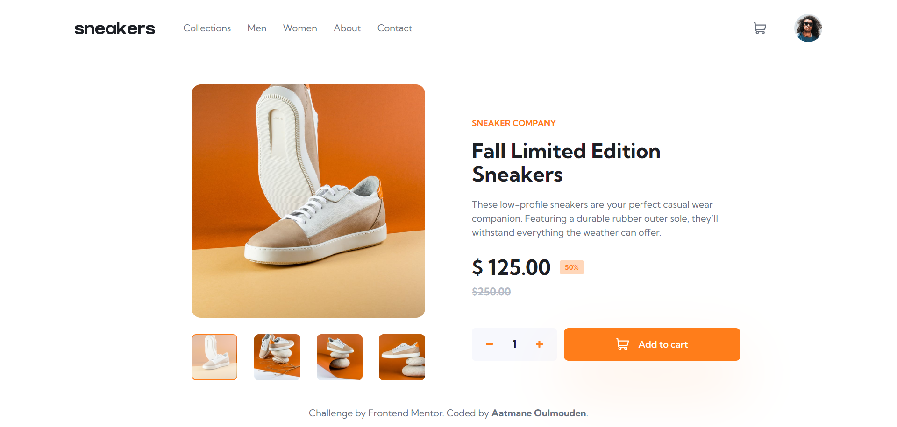

# Frontend Mentor - E-commerce product page solution

This is a solution to the [E-commerce product page challenge on Frontend Mentor](https://www.frontendmentor.io/challenges/ecommerce-product-page-UPsZ9MJp6). Frontend Mentor challenges help you improve your coding skills by building realistic projects.

## Table of contents

- [Overview](#overview)
  - [The challenge](#the-challenge)
  - [Screenshot](#screenshot)
  - [Links](#links)
- [My process](#my-process)
  - [Built with](#built-with)
- [Author](#author)

## Overview

### The challenge

Users can:

- View the optimal layout for the site depending on their device's screen size
- See hover states for all interactive elements on the page
- Open a lightbox gallery by clicking on the large product image
- Switch the large product image by clicking on the small thumbnail images
- Add items to the cart
- View the cart and remove items from it

### Screenshot

### Links

- Solution URL: [See the solution](https://www.frontendmentor.io/solutions/responsive-ecommerce-product-page-using-html-tailwindcss-and-js-dmVyd0ofwI)
- Live Site URL: [Preview the solution](https://aatmaneoulmouden.github.io/ecommerce-product-page/)

## My process

### Built with

- Semantic HTML5 markup
- CSS custom properties
- Flexbox
- CSS Grid
- Mobile-first workflow
- Vanilla Javascript
- [Tailwind CSS](https://tailwindcss.com/) - For styles

## Author

- Website - [Aatmane Oulmouden](https://bit.ly/3xScx29)
- Frontend Mentor - [@aatmaneoulmouden](https://www.frontendmentor.io/profile/aatmaneoulmouden)
- LinkedIn - [@aatmaneoulmouden](https://www.linkedin.com/in/aatmaneoulmouden/)
